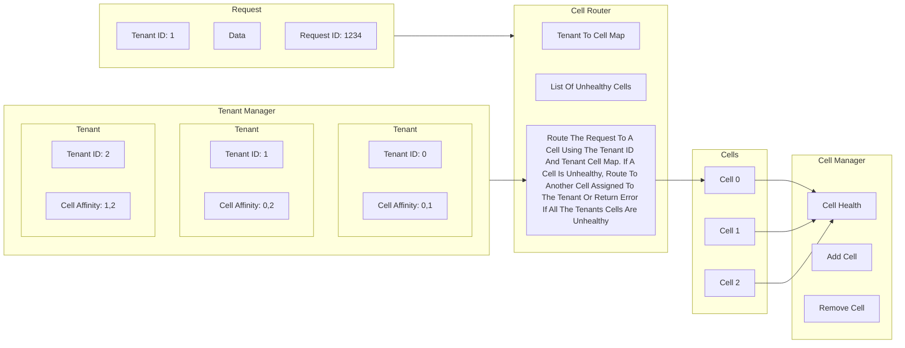

# Virtual Cell Based Architecture

After watching the AWS RE:Invent talks on cell based architectures, I needed to build something to help me understand it.

Herein lies code that simulates parts of the cell based architecture.

There is a class each that represent a cell, and a tenant. 

There are also a couple of other classes that mimic parts of the control plane, such as tenant management, and cell management.

## Program Flow

In main.py, we start by creating a bunch of cells, then we create a bunch of tenants and assign them cells.

Next we generate a bunch of requests from the tenants and send them into our cell router.

The cell router looks at the cell affinity for the tenant making the request, and forwards the request to that cell for handling.

If the cell router can not find a healthy cell to handle the request, it will return an error.

Each tenant gets 2 cells assigned to them to increase availability and fault tolerance, this could be any number but there should be vastly more cells than there are cells per tenant.

## Control Plane And Data Plane

There has been some effort to isolate the control place (Cell and Tenant Management) from the data plane (Cell Routing and Request Handling). It is important that the data place can continue operation in absence of the control plane. This decoupling will improve availability by removing dependence.

## Simulated Errors And Health

Tenant 2 is an unlucky tenant and every so often they will submit a bad request that kills the cell it is sent to.

AWS Refers to these events as black swan events.

Since each tenant has 2 cells assigned, even with 1 cell down, all requests will still be handled without issues.

Once the tenant sends a second bad request and takes out a second cell, further requests from that tenant will not succeed, and similarly for any other tenant who's set of cells matched that of the tenant which poisoned all their cells.

## Diagram

## Further Information

[AWS re:Invent 2018: How AWS Minimizes the Blast Radius of Failures (ARC338)](https://youtu.be/swQbA4zub20?si%253DdObFeWYlBGGFm88q)

## Problems With My Implementation

Cell affinity should be calculated to have as few tenants with a complete common set of cells as other tenants.

There is no balancing when new cells or tenants are added.
