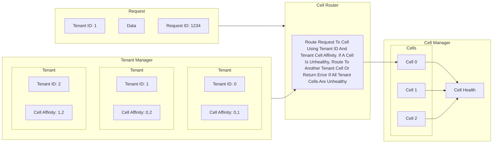

# Virtual Cell Based Architecture

```mermaid
graph LR;
    subgraph CellManager[Cell Manager]
        subgraph Cells;
            Cell0[Cell 0]
            Cell1[Cell 1]
            Cell2[Cell 2]
        end


        Cell0 --> CellHealth
        Cell1 --> CellHealth
        Cell2 --> CellHealth
        
        CellHealth[Cell Health]
    end


    subgraph TenantManager[Tenant Manager]
        subgraph Tenant0[Tenant]
            TenantId0[Tenant ID: 0]
            CellAffinity0[Cell Affinity: 0,1]
        end
        subgraph Tenant1[Tenant]
            TenantId1[Tenant ID: 1]
            CellAffinity1[Cell Affinity: 0,2]
        end
        subgraph Tenant2[Tenant]
            TenantId2[Tenant ID: 2]
            CellAffinity2[Cell Affinity: 1,2]
        end
    end


    subgraph Request[Request]
        TenantId[Tenant ID: 1]
        Data
        RequestId[Request ID: 1234]
    end

    subgraph CellRouter[Cell Router]
        RouteRequestByTenant[Route Request To Cell Using Tenant ID And Tenant Cell Affinity. If A Cell Is Unhealthy, Route To Another Tenant Cell Or Return Error If All Tenant Cells Are Unhealthy]
    end

    Request --> CellRouter
    TenantManager --> RouteRequestByTenant
    RouteRequestByTenant --> Cell0


```